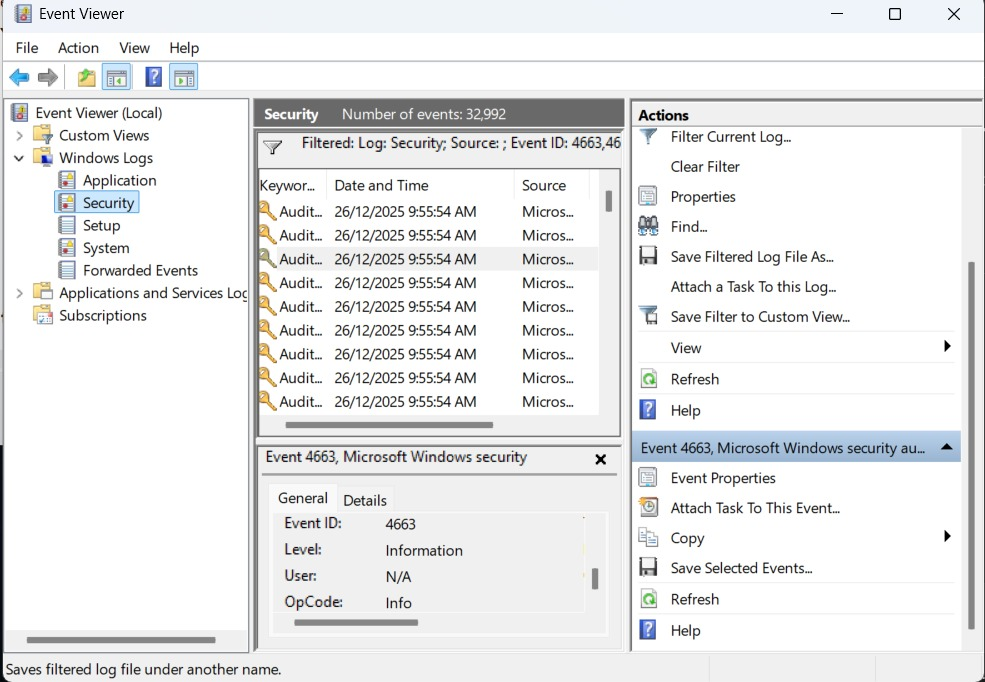

#  Insider Threat Simulation on Windows 11

##  Overview
This project simulates an **insider threat scenario** in a Windows environment, where a standard user attempts to access sensitive organizational data without authorization.

The goal is to demonstrate **access control, least privilege enforcement, and auditing**, aligning with real-world **SOC Level 1 responsibilities**.

---

##  Objectives
- Understand Windows user privilege separation
- Simulate insider threat behavior
- Restrict access using NTFS permissions
- Validate unauthorized access denial
- Observe security-related system events

---

## Environment
- **OS:** Windows 11 (Real Machine)
- **File System:** NTFS
- **Security Controls:**  
  - NTFS Permissions  
  - User Account Control (UAC)  
  - Local Security Policy  
  - Event Viewer  

---

## User Roles

| User | Role | Purpose |
|----|----|----|
| IT_Admin | Administrator | Security configuration |
| HR_User | Standard User | Insider threat simulation |

---

##  Threat Scenario
A legitimate internal employee (**HR_User**) attempts to access a restricted folder containing sensitive files.  
The attempt should be **blocked and logged**.

---

##  Actions Performed (High-Level)
- Created multiple local users
- Configured NTFS permissions
- Removed inherited access
- Restricted folder & file access
- Tested access using HR_User
- Verified access denial

---

##  Issues & Fixes
- Permission inheritance caused unintended access
- Administrator access was accidentally removed and restored
- Username format issues during permission assignment

These reflect **real-world SOC troubleshooting scenarios**.

---

##  Results

| Test | Result |
|----|----|
| HR_User folder access |  Denied |
| HR_User file access |  Denied |
| Admin access |  Allowed |

---

##  Monitoring
- Access attempts reviewed using **Event Viewer**
- Demonstrates how insider activity can be investigated

---

##  Key Learnings
- Windows access control is powerful but sensitive to misconfiguration
- Least privilege is critical in preventing insider threats
- SOC analysts must validate both **prevention and detection**

---

##  Future Improvements
- Enable advanced audit policies
- Forward logs to a SIEM
- Add detection rules for repeated access attempts

---

##  Report
Full SOC-style report available in `/report` folder.

---

##  Author
**Ifthakar Ahammad**  
B.Sc. in Cybersecurity  
Aspiring SOC Analyst 

## Screenshots & Evidence

All security-related screenshots collected during the simulation are stored in the 
[screenshots](./screenshots) directory.

Evidence includes:
- NTFS permission restrictions applied to sensitive folders
- Enabled Windows File System Auditing policy
- Security Event ID 4663 showing unauthorized file access attempts

## Screenshots & Evidence

### 1. HR User Standard Account

### 2. NTFS Permission – Admin Only

### 3. Unauthorized Access – Access Denied

### 4. File System Auditing Enabled

### 5. Security Event ID 4663 (Object Access)

